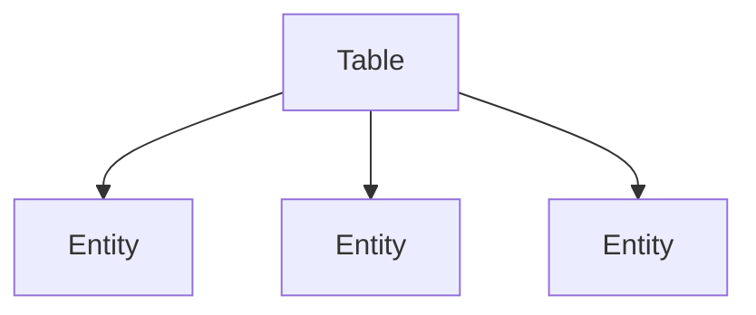

import { Aside, Badge, Card, CardGrid } from '@astrojs/starlight/components';

Entities define each data model that belongs to a respective table. Following [Single Table](https://www.alexdebrie.com/posts/dynamodb-single-table/) design, this means that one table will have many Entities belonging to it.



## Basic Usage

In its most basic form, an entity is simply a binding of `schema` that defines the shape of your data using [Zod](https://zod.dev/), and the `DynamoTable` that it belongs to.

```ts
import { DynamoTable, DynamoEntity } from 'dynamo-document-builder';
import { z } from 'zod';

const parentTable = new DynamoTable({
  // table config
});

const exampleEntity = new DynamoEntity({
  table: parentTable,
  schema: z.object({
    id: z.string(),
    name: z.string(),
  }),
});
```

<Aside type='note' title='Schema Type'>
The `schema` must always be a Zod `object()` schema type. This allows you to define custom validation at the Item level using somethinglike [`.refine()`](https://zod.dev/api#refine). Internally this is also how Document Builder is able to infer the TypeScript types for your data model from Zod.
</Aside>

## Computed Primary Keys

Many times when working with DynamoDB (especially when working with [Single Table](https://www.alexdebrie.com/posts/dynamodb-single-table/) design), you will want to *compute* your primary key attributes from the data in your item.

For example, let's assume we have the following `Todo` entity:

```ts
const todoEntity = new DynamoEntity({
  table: parentTable,
  schema: z.object({
    id: z.string(),
    userId: z.string(),
    title: z.string(),
    completed: z.boolean(),
  }),
});
```

We might decide that we want our partition key to be a combination of the ID of the to-do itself (the `id` attribute) and the ID of the user that owns the to-do (the `userId` attribute). Typically in DynamoDB this would be modeled as a separate `PK` attribute with these two values combined like this: `USER#<userId>#TODO#<todoId>`.

However this now adds additional complexity to our application code, as we now have to ensure that every item persisted to DynamoDB has this `PK` attribute properly set.

Document Builder provides a way to automatically generate these types of keys for you, using a simple function passed to the entity constructor:

```ts
const todoEntity = new DynamoEntity({
  table: parentTable,
  schema: z.object({
    id: z.string(),
    userId: z.string(),
    title: z.string(),
    completed: z.boolean(),
  }),
  partitionKey: todo => `USER#${todo.userId}#TODO#${todo.id}`,
  sortKey: todo => `COMPLETED#${todo.completed}`,
});
```

Now when we use Document Builder to write data to DynamoDB, it will automatically compute the `PK` and `SK` attributes for us based on the functions we provided.

<Aside type='note' title='Attribute Stripping on Reads'>
These generated primary key attributes will not show up from Reads due to being stripped by the Zod schemas (unless you pass `skipValidation` to the relevant read operation).
</Aside>

### The `key` function

Creating keys that are separated by `#` is such a common pattern in DynamoDB that Document Builder provides a helper function called `key` that you can use to simplify the process of creating these composite keys.

```ts
const todoEntity = new DynamoEntity({
  table: parentTable,
  schema: z.object({
    id: z.string(),
    userId: z.string(),
    title: z.string(),
    completed: z.boolean(),
  }),
  partitionKey: todo => key('USER', todo.userId, 'TODO', todo.id),
  sortKey: todo => key('COMPLETED', todo.completed),
});
```

This code would result in the same generated keys as the previous example, but now is a little bit more readable.

## Secondary Indexes

In addition to defining the primary keys for an entity, you can also define key builders for both global and local secondary indexes.

First, you'll need to define the actual names of the secondary index attribute keys in the table:
```ts
const table = new DynamoTable({
  tableName: 'ExampleTable',
  documentClient: DynamoDBDocumentClient.from(new DynamoDBClient()),
  keyNames: {
    partitionKey: 'PK',
    sortKey: 'SK',
    globalSecondaryIndexes: {
      GSI1: {
        partitionKey: 'GSI1PK',
        sortKey: 'GSI1SK',
      },
    },
    localSecondaryIndexes: {
      LSI1: {
        sortKey: 'LSI1SK',
      },
    },
  },
});
```
In the above example, `GSI1` and `LSI1` are the names of your secondary indexes and are what you use when needing to refer to them elsewhere in your code.

Then you can define the corresponding key builders in the entity itself:
```ts
const exampleEntity = new DynamoEntity({
  table,
  schema: z.object({
    id: z.string(),
    category: z.string(),
    createdAt: z.string(),
  }),
  partitionKey: item => key('CATEGORY', item.category),
  sortKey: item => key('ITEM_ID', item.id),
  globalSecondaryIndexes: {
    GSI1: {
      partitionKey: item => key('ITEM_ID', item.id),
      sortKey: item => key('CREATED_AT', item.createdAt),
    },
  },
  localSecondaryIndexes: {
    LSI1: {
      sortKey: item => key('CREATED_AT', item.createdAt, 'ITEM_ID', item.id),
    },
  },
});
```

Now if you were to `Put` an item using this entity, Document Builder would automatically generate the appropriate attributes for the primary keys as well as the secondary index keys (example below).

```json
{
  "PK": "CATEGORY#Books",
  "SK": "ITEM_ID#123",
  "GSI1PK": "ITEM_ID#123",
  "GSI1SK": "CREATED_AT#2024-06-01T12:00:00Z",
  "LSI1SK": "CREATED_AT#2024-06-01T12:00:00Z#ITEM_ID#123",
  "id": "123",
  "category": "Books",
  "createdAt": "2024-06-01T12:00:00Z"
}
```

<Aside type='tip' title='Multi-attribute Secondary Indexes'>
DynamoDB now supports defining multi-attribute keys for global secondary indexes, meaning that you may not even need to use composite keys separated by `#` for your secondary indexes anymore.

See the [AWS Docs](https://docs.aws.amazon.com/amazondynamodb/latest/developerguide/GSI.DesignPattern.MultiAttributeKeys.html) for more information.
</Aside>

## Commands

Document Builder uses the same command pattern as the AWS SDK v3 to perform operations on entities. This is done using the `.send()` method on the entity instance.

```ts
await todoEntity.send(new Put({
  item: {
    id: '123',
    userId: '456',
    title: 'Buy groceries',
    completed: false,
  },
}));
```

<CardGrid>
  <Card title='Read Commands'>
     - [Get](/guides/commands/get)
     - [Query](/guides/commands/query)
     - [Scan](/guides/commands/scan)
     - [BatchGet](/guides/advanced/batching)
     - [TransactGet](/guides/advanced/transactions)
  </Card>
  <Card title='Write Commands'>
     - [Put](/guides/commands/put)
     - [Update](/guides/commands/update)
     - [Delete](/guides/commands/delete)
     - [BatchWrite](/guides/advanced/batching)
     - [TransactWrite](/guides/advanced/transactions)
  </Card>
</CardGrid>

<br />

<Aside type='note' title='Why not use methods directly on the entity?'>
The reason for this design is exactly the same reason that the AWS SDK does it, it ensures tree-shakability. The implementation for each command is separated, allowing you to only import the code for the commands you're actually using in your code.
</Aside>

## Entity Type

Using TypeScript, we don't really care about the type of the `DynamoEntity` itself, rather the type of the schema data that the entity represents.

For this, Document Builder providers a uility type `Entity<T>` that you can use to infer the type of your entity's schema data. This works exactly like Zod's `infer` utility type.

```ts
const userEntity = new DynamoEntity({
  table: parentTable,
  schema: z.object({
    id: z.string(),
    name: z.string(),
    email: z.string().email(),
  }),
});

type User = Entity<typeof userEntity>;
```


## Codecs

Zod introduced [Codecs](https://zod.dev/codecs) in version 4.1 which enable developers to implement custom serialization and deserialization logic for their schemas. Document Builder takes full advantage of this feature internally and uses the appropriate `encode` and `decode` (async) methods when reading and writing data to DynamoDB.

This allows enables you as the developer to more easily work with higher-level data types in your entity schemas (such as `Date`, `Map`, and `Set`), while still having the data properly persisted to DynamoDB.

Here's an example of using Codecs to work with `Date` attributes in your entity schema:

```ts
const stringToDate = z.codec(
  z.iso.datetime(),
  z.date(),
  {
    encode: date => date.toISOString(),
    decode: isoString => new Date(isoString),
  }
);

const eventEntity = new DynamoEntity({
  table: parentTable,
  schema: z.object({
    id: z.string(),
    name: z.string(),
    eventDate: stringToDate,
  }),
});

await eventEntity.send(new Put({
  item: {
    id: '1',
    name: 'Conference',
    eventDate: new Date(2025, 1, 1),
  },
}));
```

<Aside type='caution' title='Warning about Codec Deserialization'>
All commands implemented by Document Builder provide a `skipValidation` option that will skip the Zod schema validation when reading or writing items to DynamoDB. If you use this option with an entity that uses Codecs, the data will not be properly serialized or deserialized and you may run into runtime errors in your application.

For cases when you need to work with raw data, Document Builder provides a corresponding `EncodedEntity` helper type that works identically to the `Entity` helper type, except will return the encoded data type
</Aside>

## Tree-shakable Import

```ts
import { DynamoEntity } from 'dynamo-document-builder/entity';
```

## API Reference

- [`DynamoEntity`](/api-reference/classes/dynamoentity)
- [`DynamoEntityConfig`](/api-reference/type-aliases/dynamoentityconfig)
